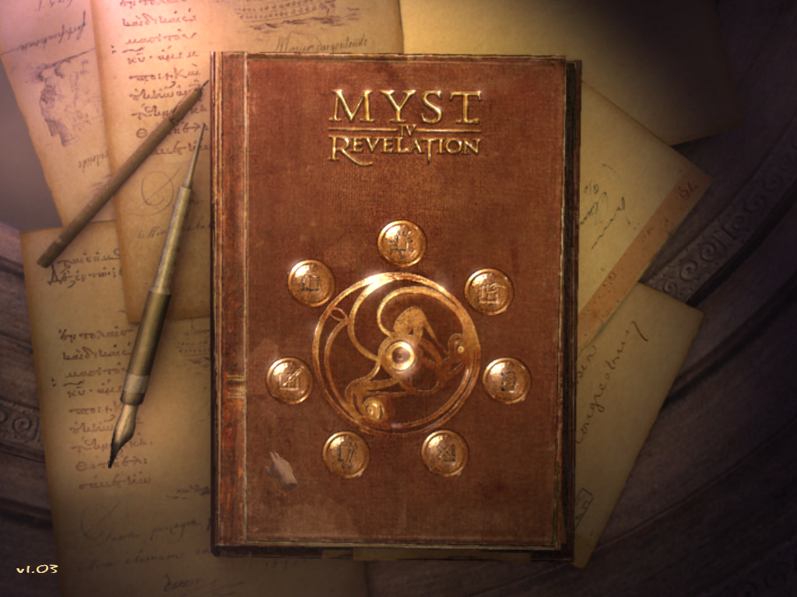

# *Indirect*Input

A simple DirectInput wrapper to work around a Windows [device enumeration bug](https://aka.ms/AA3931c).

## Game support

- Myst 4: Revelation 1.0-1.3 (Retail disc and GOG editions)

## Install (Myst 4: Revelation)

1. Drop `dinput.dll` into the `[game root]\bin` directory.
2. You're done.

## Supported operating systems ##

- Windows 10
- Windows 11
